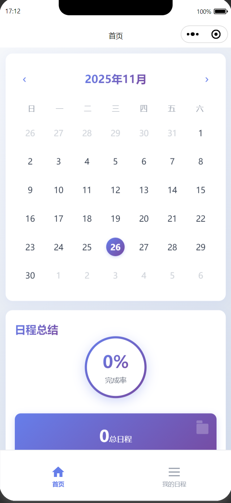
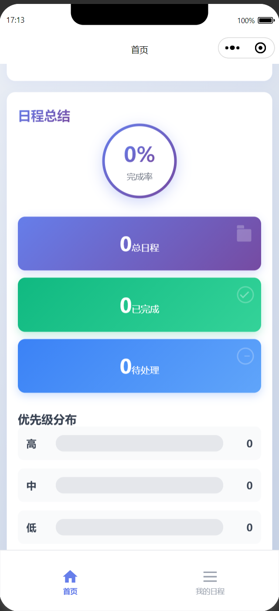
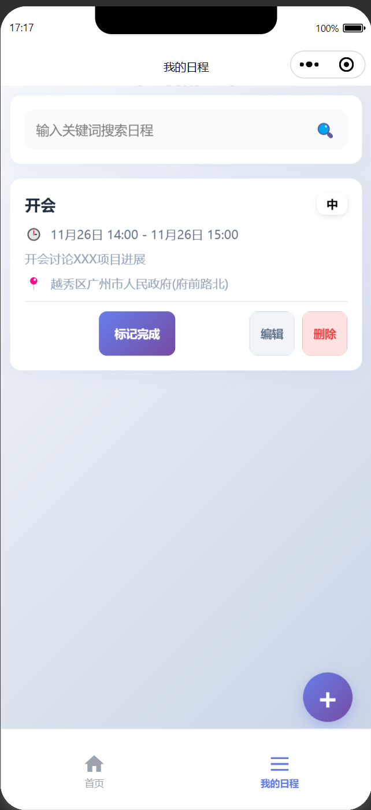
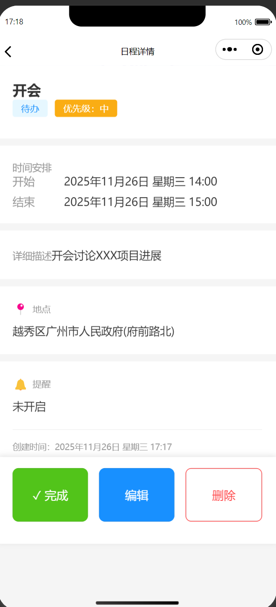
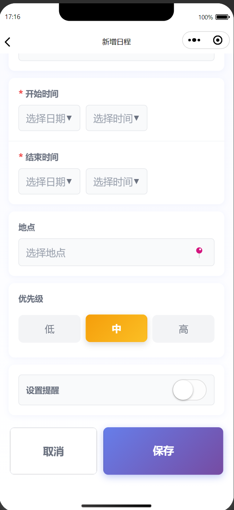

# 日程管理小程序

一个基于 Taro 框架开发的多端日程管理小程序，支持微信小程序、H5 等多个平台。

## 项目简介

这是一个功能完整的日程管理应用，具有以下特性：

- 📅 日历视图展示日程安排
- 📋 日程列表管理
- ⭐ 优先级设置（高、中、低）
- ✅ 状态管理（待处理、已完成）
- 🔍 多维度筛选（标题、优先级、状态、日期）
- 📍 地点选择
- 📱 响应式设计，适配多种设备

## 技术栈

- [Taro](https://taro.jd.com/) v4.1.8 - 多端开发框架
- React v18 - 前端框架
- TypeScript - 静态类型检查
- Redux - 状态管理
- Sass - CSS 预处理器

## 功能特性

### 首页
- 日历视图展示日程分布
- 日程统计摘要
- 点击日期快速创建日程




### 日程列表
- 按优先级、状态、日期等多维度筛选
- 支持标题搜索
- 日程项展示优先级标签和状态
- 标记完成/未完成状态



### 日程详情
- 查看日程详细信息
- 编辑或删除日程
- 切换日程状态



### 创建日程
- 设置日程标题、描述、地点
- 选择开始和结束时间
- 设置优先级
- 地点选择（使用微信小程序API）



## 项目结构

```
src/
├── actions/          # Redux actions
├── components/       # 公共组件
├── constants/        # 常量定义
├── custom-tab-bar/   # 自定义 tabBar
├── pages/            # 页面组件
├── reducers/         # Redux reducers
├── store/            # Redux store 配置
├── types/            # TypeScript 类型定义
└── utils/            # 工具函数
```

## 快速开始

### 安装依赖

```bash
npm install
```

### 开发调试

```bash
# 微信小程序开发模式
npm run dev:weapp

# H5 开发模式
npm run dev:h5
```

### 构建部署

```bash
# 构建微信小程序
npm run build:weapp

# 构建 H5
npm run build:h5
```

## 配置说明

### 环境配置

项目包含开发环境和生产环境配置：

- `config/dev.js` - 开发环境配置
- `config/prod.js` - 生产环境配置

### 小程序配置

在 `app.config.ts` 中配置了以下内容：

- 页面路由
- 窗口表现
- tabBar 导航
- 权限声明

## 状态管理

使用 Redux 进行全局状态管理：

- 日程数据存储
- 筛选条件管理
- 页面间状态同步

## 注意事项

1. 项目使用 Taro 框架，支持多端编译
2. 样式单位使用 px，Taro 会自动转换为 rpx
3. 图标使用 SVG 格式，支持多端显示
4. 地点选择功能需要在微信开发者工具中调试

## 许可证

MIT